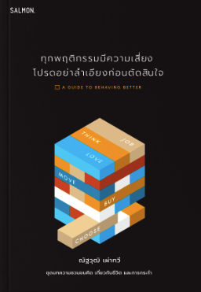

## Cognitive Bias - อคติทางความคิด (part 0)

```
สรุปหนังสือ ทุกพฤติกรรมมีความเสี่ยงโปรดอย่าลำเอียงก่อนตัดสินใจ ในบทความนี้จะสรุปในเรื่อง Cognitive Bias หรือ อคติทางความคิด
```

**_Cognitive Bias_** นั้นคือคำที่ใช้ในการอธิบายพฤติกรรมการตัดสินในของเราว่าทำไมถึงต่างออกจากจากบรรทัดฐาน (norm) หรือเหตุผล

### ตัวอย่าง Social Norm Effect

เมื่อผมและเพื่อนๆจะไปดูหนังด้วยกันโดยส่วนตัวแล้วผมอยากดูหนังเรื่อง [IT](https://www.imdb.com/title/tt1396484/) แต่เพื่อนๆในกลุ่มอยากดู [ฤดูฝัน ฉันมีเธอ](https://th.wikipedia.org/wiki/%E0%B8%A4%E0%B8%94%E0%B8%B9%E0%B8%9D%E0%B8%B1%E0%B8%99_%E0%B8%89%E0%B8%B1%E0%B8%99%E0%B8%A1%E0%B8%B5%E0%B9%80%E0%B8%98%E0%B8%AD) ทำให้ผมนั้นจำเป็นต้องดูเรื่อง [ฤดูฝัน ฉันมีเธอ](https://th.wikipedia.org/wiki/%E0%B8%A4%E0%B8%94%E0%B8%B9%E0%B8%9D%E0%B8%B1%E0%B8%99_%E0%B8%89%E0%B8%B1%E0%B8%99%E0%B8%A1%E0%B8%B5%E0%B9%80%E0%B8%98%E0%B8%AD) เพราะว่าเพื่อนๆในกลุ่มอยากดูทุกคน

จากเหตุการนี้ก็คือรูปแบบนึงของ **_Cognitive Bias_** ที่เรียกว่า **_Social Norm Effect_**



Ref . สรุปจากหนังสือ **_ทุกพฤติกรรมมีความเสี่ยงโปรดอย่าลำเอียงก่อนตัดสินใจ_**
